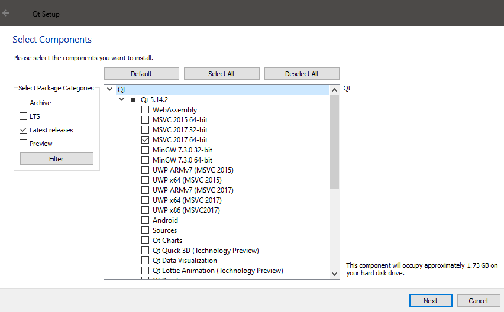
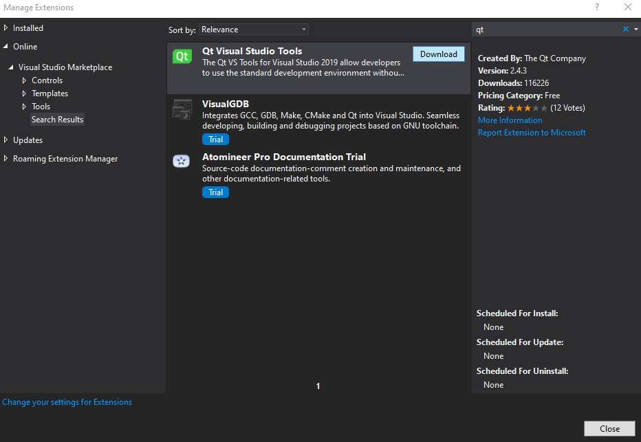
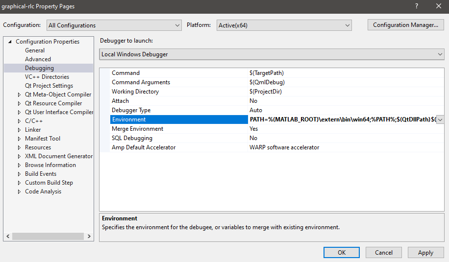

# Graphical RLC
This repo is mostly for a Circuits 2 project. It creates a graphical UI for users to easily simulate RLC designs.
This project utilizes Qt 5.14.2 and a connection to the Matlab engine for simulations.  

End users should only require Matlab with Simulink installed. Users require Matlab version R2017b or higher.
This project is licensed under GPLv3. License can be found [here](./license.txt).
## Requirements for Development
* Matlab R2017b and above. Older versions might work, but no promises
* Appropriate Simulink version. Used Simulink 10.1 with Matlab R2020a
* Qt 5.14.2. See the [Qt setup instructions](#qt)
* Visual Studio 2017 or higher. Visual Studio 2019 was used for this project
* Windows 10 64-bit. Used Version 10.0.18363 Build 18363. Newer/older Windows 10 versions and builds should work fine.
## Setting Up
### Matlab
1. Enter `matlabroot` into the Matlab command prompt to obtain the root directory of Matlab.
2. Add MATLAB_ROOT to the windows environment variables with the path obtained from the above Matlab command. Please see [example repo](https://github.com/blaksmith205/cpp-with-matlab) for more information on connecting Visual Studio with Matlab.
### Qt
Not sure how to setup building Qt from source, so the following uses the Qt installer.
1. Visit the [Qt website](https://www.qt.io/download-open-source) and select 'Download the Qt Online Installer'.
2. After downloading and running the online installer, create a free Qt account and accept the Open Source obligations.
3. Go through the installation process and chose a folder to install Qt. Note: Make sure there are no spaces in the file path as it could cause problems. Uncheck the 'associate common file types with Qt creator' option.
4. Under the select components page, chose 'MSVC 2017 64-bit' option under Qt 5.14.2. Leave everything else as default.     
### Visual Studio
This is only required if the Qt Vs Tools extension is not installed. To install it:
1. Open up the .sln file in this repo with Visual Studio.
2. Under the Extensions tab, select manage extensions.
3. Search `qt` under the online tab of the Extension Manager. Select 'Qt Visual Studio Tools' by The Qt company.  

4. Close out of Visual Studio to install the extension.
5. Once installed, reopen the project in Visual Studio. Select 'Qt options' Under Extensions->Qt Vs Tools.
6. Click on the 'Add' button under the Qt Versions tab. Add the version number and `<install_path>\Qt5.14.2\5.14.2\msvc2017_64` to the path.
	* Example path: F:\Qt\Qt5.14.2\5.14.2\msvc2017_64
7. Right click on the project solution under Solution Explorer window, and select properties.
8. Under the 'Debugging' tab, add `%(MATLAB_ROOT)\extern\bin\win64;` before `%PATH%;` option inside the Environment setting.  

